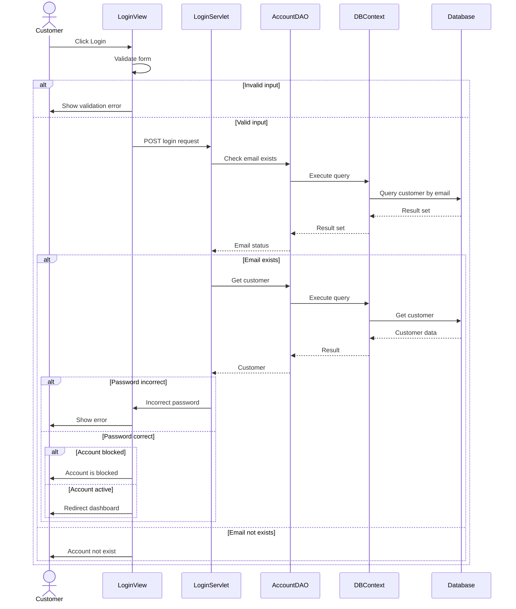

```mermaid
sequenceDiagram
    actor Customer
    participant LoginView
    participant LoginServlet
    participant AccountDAO
    participant DBContext
    participant Database

    Customer ->> LoginView: Click Login
    LoginView ->> LoginView: Validate form

    alt Invalid input
        LoginView ->> Customer: Show validation error
    else Valid input
        LoginView ->> LoginServlet: POST login request

        LoginServlet ->> AccountDAO: Check email exists
        AccountDAO ->> DBContext: Execute query
        DBContext ->> Database: Query customer by email
        Database -->> DBContext: Result set
        DBContext -->> AccountDAO: Result set
        AccountDAO -->> LoginServlet: Email status

        alt Email exists
            LoginServlet ->> AccountDAO: Get customer
            AccountDAO ->> DBContext: Execute query
            DBContext ->> Database: Get customer
            Database -->> DBContext: Customer data
            DBContext -->> AccountDAO: Result
            AccountDAO -->> LoginServlet: Customer

            alt Password incorrect
                LoginServlet ->> LoginView: Incorrect password
                LoginView ->> Customer: Show error
            else Password correct
                alt Account blocked
                    LoginView ->> Customer: Account is blocked
                else Account active
                    LoginView ->> Customer: Redirect dashboard
                end
            end
        else Email not exists
            LoginView ->> Customer: Account not exist
        end
    end
```
